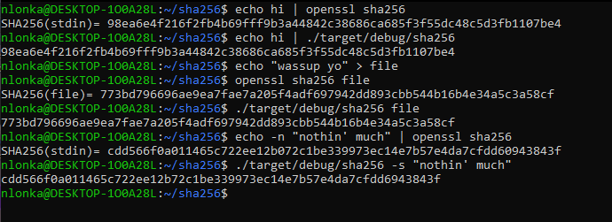

<a id="readme-top"></a>

<div align="center">
  <h2 align="center">sha256</h3>
</div>

<details>
  <summary>Table of Contents</summary>
  <ol>
    <li>
      <a href="#about-the-project">About the project</a>
    </li>
    <li>
      <a href="#getting-started">Getting started</a>
      <ul>
        <li><a href="#prerequisites">Prerequisites</a></li>
        <li><a href="#how-to-run-it">How to run it</a></li>
      </ul>
    </li>
    <!--<li><a href="#roadmap">Roadmap</a></li>-->
  </ol>
</details>


<!-- ABOUT THE PROJECT -->
## About the project



This was the third and final project on my personal 10-day hackathon to learn about cryptography, and coding in rust, and to deepen my knowledge about network protocols and TLS/SSL.

This is the actually secure hashing algorithm sha256 but coded in rust. The program takes in input as either a string, a file or reads it from the stdin, and then shuffles it around with some efficiently encrypting math magic a couple of smart guys from the NSA came up with way back when.


<!-- GETTING STARTED -->
## Getting started

This is how you might run this program locally.
Do note that it was originally made for a unix system, so your mileage may vary depending on your machine. 

### Prerequisites

As this program is coded in rust, you need to have rust and cargo installed

### How to run it

The program takes input as either a string, a file or reads it from the stdin

```
git clone https://github.com/Rubidium7/sha256.git
cd sha256
cargo build
./target/debug/sha256 -s <string>
  or
./target/debug/sha256 <filename>
  or
./target/debug/sha256 (<= will read stdin) 
```

<!-- ROADMAP -->
<!--## Roadmap

- [ ] Feature 1
- [ ] Feature 2
- [ ] Feature 3
    - [ ] Nested Feature -->


<p align="right">(<a href="#readme-top">back to top</a>)</p>
